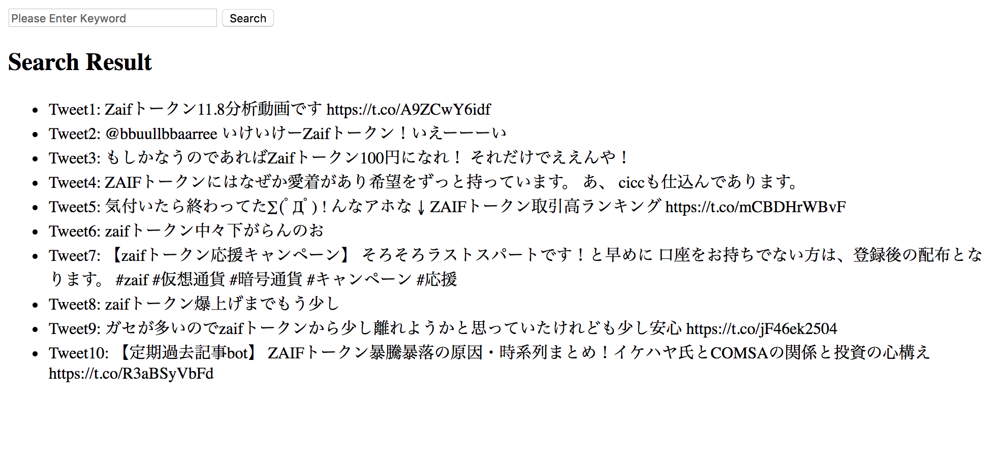

# LINE BOT
# LINE BOT
# LINE BOT
## LINE API
## Twitter API
```rb
# プロジェクト作成
rails new .
# TweetsControllerコントローラー作成
rails g controller tweets search
# Tweetモデル作成
rails g model Tweet
# application.ymlの内容をherokuの環境変数に反映
figaro heroku:set -e production
```
### http://localhost:3000/tweets/search

### 検索結果

